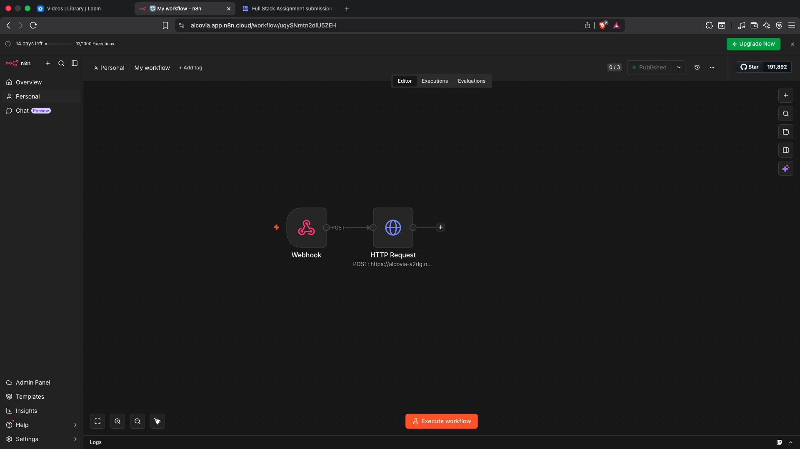

# Decisions

## Basic App Setup

There is no login because the assignment asks for one hardcoded account. Both devices use `student_1`.

The phone, laptop and tablet profiles have separate AsyncStorage keys. This lets one browser act like multiple devices without the profiles reading the same local data.

Redux stores the current screen data. AsyncStorage saves that data and the pending operation queue. The screen updates first, so the student does not have to wait for the internet.

## Feature A: Focus Sessions

The student chooses a target and starts a session. Starting, completing and failing are saved as separate operations. This is why the complete flow works while the device is offline and can sync later.

`sessionTiming.ts` inside the features folder contains the 5 second rule code.

The focus file inside components contains the focus code where the timer is calculated using `Date.now()` instead of subtracting a single second every time. This avoids timer problems when a browser or device delays an interval for a short time.

If the student presses Give Up, the session fails with `give_up`. If the student leaves the Focus page or backgrounds the app for more than five seconds, it fails with `app_switch`. A failed session is recorded but receives no reward.

Express checks the stored start time, completion time and target before accepting a success. A session cannot finish early and still get coins. Every valid success gives 50 coins and adds the target minutes to today's focus total. The streak advances only for the first successful session on a UTC day, so completing more sessions on the same day does not inflate it.

The stable `sessionId` is used as the reward key. Replaying the same success does not give the reward again.

While a session is running, the app saves its last active time and the time it first went away. If the page is refreshed or the app is reopened, these saved values are checked before the timer continues. More than five seconds away records `app_switch`; a shorter restart resumes from the original start time.

## Feature B: Syllabus Progress

Every subject contains chapters and every chapter contains tasks. A task can be Not Started, In Progress or Done. Changing the status updates Redux immediately, so chapter and subject progress also changes immediately while offline.

Chapter progress is completed active tasks divided by all active tasks in that chapter. Subject progress is completed active tasks divided by all active tasks across the subject. We used all tasks instead of averaging chapter percentages because chapters can have different numbers of tasks.

We could not use last write wins because it depends on device time. A phone and laptop may have different clocks, so the same edits could produce different answers.

We use a deterministic progress-rank merge instead:

```text
not_started = 0
in_progress = 1
done = 2
```

The higher value wins. Done therefore beats In Progress even if the operations reach Express in the opposite order. Delete wins against an edit, and the deleted task remains as a tombstone so an older edit cannot bring it back. A tombstone always stores the same neutral task status, so its hidden data also converges in every arrival order.

This was the most difficult part of Feature B. The rule had to give the same result in every arrival order without trusting either device clock.

## Feature C: n8n Automation

Express creates an automation event only after it accepts a valid focus success. The event id is `focus-success:<sessionId>`.

The backend sends the event to `N8N_WEBHOOK_URL`. It also sends `notificationSinkUrl` from `NOTIFICATION_SINK_URL`, so no deployed URL is hardcoded in the code.

n8n sends the message to the mock Express notification sink. The sink stores only one notification for each `sessionId`. The Alerts page requests these notifications and shows them inside the app.

The backend keeps an automation delivery record. A failed delivery stays available for retry. A delivered event is not sent as a new event again. The sink also deduplicates the session, which protects the notification if an HTTP response is lost and a request is retried.

## Sync and Two Devices

Every offline action creates a `SyncOperation` with a stable `operationId`. When the device is online, it sends its pending operations to Express.

Express applies each operation id once, merges the result and returns the server state. The client then uses that result as its current state. When both devices sync, both receive the same result.

A focus completion that arrives before its start is not rewarded immediately. It is checked again after the matching start arrives. A successful session also cannot be changed back to running or failed by an older message.

Only one sync request can run from a client at a time. If the network is turned off during sync, the active request is cancelled. A timeout or failed request does not remove pending operations. The Sync Lab shows Retry needed and the number of operations that are still saved. Retrying is safe because Express ignores operation ids it has already applied.

## What Each Control Does

| Control | Why it is present |
| --- | --- |
| Online switch | Simulates a connected or disconnected device. Turning it on also tries to sync saved changes. |
| Home | Opens the student dashboard and current summary. |
| Focus | Opens the focus timer and recent attempts. |
| Learn | Opens subjects, chapters, tasks and their progress. |
| Sync | Opens the dev panel used to show offline queues and conflict handling. |
| Alerts | Opens the notification list returned by the backend. |
| Start Focus | Opens the Focus page from the dashboard. |
| View Tasks or Open Syllabus | Opens the Learn page. |
| Open Sync Lab | Opens the Sync page. |
| Duration buttons | Select the target length before a session starts. |
| Start Session | Saves a running session locally and queues its start operation. |
| Give Up | Fails the running session locally with the `give_up` reason. |
| Task status buttons | Change a task and recalculate progress without waiting for the network. |
| Phone and Laptop | Switch between the two separate saved device profiles. |
| Sync Now | Retries the pending queue and requests the latest server result. |
| Reset Device | Resets the mock server's database and clears all local device states for a fresh test. |
| Set In Progress and Set Done | Create a clear two-device status conflict for the demo. |
| Delete Task | Creates an edit-versus-delete conflict using a tombstone. |
| Replay Last | Adds the exact last operation again to prove duplicate messages are ignored. |

## Mobile Bottom Navigation Layout Fix

We resolved an overlap issue on mobile layouts. Because the bottom bar was positioned absolutely (`bottom-0`) without an explicit z-index, the `ScrollView` content was rendering in a way that intercepted click events on the upper half of the navigation bar. This led to accidental clicks on hidden background buttons (e.g., starting a focus session when attempting to switch tabs). We added `z-50` and an explicit `zIndex: 50` style to the bottom bar, and increased the button padding (`py-3`) to enlarge the touch target area.

## Successful App Flow

1. The student starts a focus session or changes a task.
2. The app updates Redux immediately.
3. The state and pending operation are saved in the selected device's AsyncStorage key.
4. The student can continue using the feature while offline.
5. When the device reconnects, its pending operations are sent to Express.
6. Express validates each operation, ignores duplicates and applies the merge rules.
7. A valid focus success is rewarded once and creates one automation event.
8. Express sends the event to n8n.
9. n8n calls the notification sink, which stores one notification for that session.
10. Express returns the merged state and the client clears the accepted operations.
11. The dashboard shows the updated reward, and the Alerts page shows the notification.
12. The second device receives the same state after it syncs.

## Storage Choice

AsyncStorage was chosen because it works with Expo and is enough for the amount of data in this assignment.

Express uses atomically written JSON files. This keeps the backend easy to run and lets operation ids, rewards and automation deliveries survive a normal local process restart. A production version should use SQLite or Postgres with unique constraints. Local files on a free hosting service may be replaced during a redeploy.

## Main Tradeoff

After sync, the server returns the full merged state instead of only returning the changed records. This makes the sync code easier to understand and makes convergence easy to demonstrate. It sends more data than a delta-sync design, but the assignment data is small enough for this choice.

## n8n First and Express Migration

`n8n-reward-prototype.json` contains the simple reward prototype. It receives a successful session, checks `sessionId`, adds 50 coins, advances the streak only when the completion date is different from `lastStreakDate`, and remembers rewarded sessions in n8n workflow data.

The final app uses the same reward rule inside Express. Express was chosen for the final version because it already has the saved focus start, target and completion time. It can validate the session and update coins, streak and focus minutes as one backend change. n8n remains responsible for the notification, which is easier to change without moving important account state out of Express.

The n8n version is useful for testing a rule quickly. Its fallback is the Express version, which is better when the rule needs strict validation, durable storage and safe sync behavior.

## Requirement Check

Feature A is built: offline start, automatic success, Give Up, five-second app-switch failure, server timing checks and one reward per session.

Feature B is built: offline task edits, instant chapter and subject progress, progress-rank conflicts, delete tombstones and duplicate handling.

Feature C is built: server-confirmed events, a real exported n8n workflow, a mock notification sink, duplicate protection and notifications displayed in the app.

The core two-device setup is built using separate phone and laptop storage. The Sync Lab can show divergence, convergence, status conflicts, delete conflicts and duplicate replays.

The frontend and backend use TypeScript. The frontend is React Native with Expo Router, the backend is Express, and no off-the-shelf sync product is used.

The backend also has a random convergence test. It creates task status edits, deletes, duplicates and different arrival orders, then checks that every order produces the same task state.

The Sync Lab supports phone, laptop and tablet. When Express has to reject a lower progress edit or an edit made after deletion, it returns a conflict notice. The Sync Lab shows the rule that was used and the value that was kept.

## Optional Extensions

The following extensions are not part of the completed core assignment:

- A user-facing screen for conflicts that need a manual choice
- Delta sync that returns only changes instead of the full merged state
- A two-way notification reply flow
- A real-phone Expo Go demo

Real WhatsApp delivery was also not added. The assignment allows the current mock HTTP notification sink, so this does not leave a core requirement incomplete.

n8n workflow 
